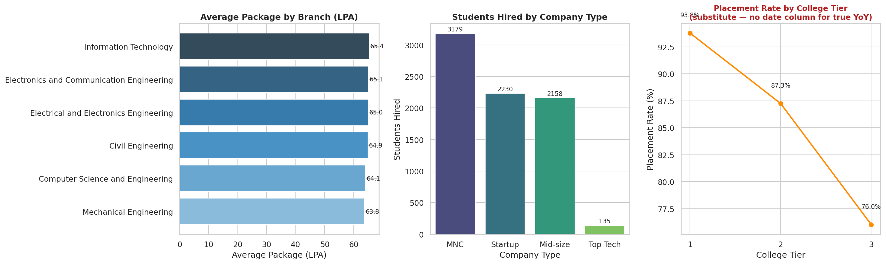

# College Placement Data Analysis
# Live demo:https://studentplacementanalysis.netlify.app/

A data-analyst case study on a college placement dataset (9,000 students):
data quality audit → cleaning → exploratory analysis → an interactive
dashboard, with every decision documented along the way.

## Project structure

```
placement-analysis/
├── data/
│   ├── raw/                     # original, untouched source file
│   └── processed/                # cleaned dataset used for analysis
├── scripts/
│   ├── 01_check_sources.py       # checks for multiple sources that need merging
│   ├── 02_audit_data_quality.py  # read-only audit: duplicates, missing values, formatting
│   ├── 03_clean_data.py          # applies the cleaning decisions below
│   └── 04_analysis.py            # the three core findings (package, hiring, placement rate)
├── dashboard/
│   └── placement_dashboard.html  # interactive dashboard (open directly in a browser)
├── reports/
│   ├── data_quality_audit.md     # full audit write-up
│   ├── data_dictionary.md        # column-by-column reference for the cleaned data
│   ├── summary_for_students.md   # plain-language takeaways
│   └── placement_dashboard.png   # static version of the dashboard
├── requirements.txt
├── LICENSE
└── README.md
```

## How to run

```bash
pip install -r requirements.txt

python scripts/01_check_sources.py       # confirms there's one source, no merge needed
python scripts/02_audit_data_quality.py  # prints the full data quality audit
python scripts/03_clean_data.py          # writes data/processed/student_placement_cleaned.csv
python scripts/04_analysis.py            # prints the three core findings
```

Then open `dashboard/placement_dashboard.html` directly in a browser — no server
needed, no dependencies, works offline.

### Live demo (GitHub Pages)
`index.html` at the project root is the same dashboard, placed there so GitHub
Pages can serve it directly. After pushing, enable Pages in the repo's
**Settings → Pages → Source: main branch, / (root)**, and the dashboard will be
live at:
```
https://studentplacementanalysis.netlify.app/
```

## Preview



## Dataset

`data/raw/student_placement_salary_elite_v2.csv` — 9,000 students, 20 columns:
academic profile (CGPA, branch, college tier), skills and test scores, and
placement outcome (placed, company type, job role, salary in LPA).

## Process

### 1. Data quality audit (`reports/data_quality_audit.md`)
Before touching anything, the raw file was audited for duplicates, missing
values, and formatting inconsistencies. Key findings:
- No duplicate rows.
- `company_type`, `job_role` are null, and `salary_lpa` is `0`, for exactly
  the 1,298 unplaced students — missing-ness is structural, not random.
- `resume_score` exceeds its expected 0–100 scale in 303 rows.
- The dataset has **no date, year, or batch column** — this limits what kind
  of trend analysis is possible (see Limitations below).

### 2. Cleaning (`scripts/03_clean_data.py`)
| Issue | Fix |
|---|---|
| `salary_lpa = 0` for unplaced students | → `NaN` |
| `company_type` / `job_role` null for unplaced | → `"Not placed"` |
| `resume_score` > 100 | Capped at 100; raw value kept in `resume_score_raw` |
| `skill_score` (= sum of 4 skill flags, redundant) | Dropped |
| `branch` abbreviations | Standardized to full names |

### 3. Analysis (`scripts/04_analysis.py`)
Three core findings, each backed by a chart in the dashboard:
1. **Average package by branch** — nearly flat across branches (₹63.8L–₹65.4L)
2. **Hiring volume by company type** — MNC leads (3,179), Top Tech pays more
   per hire but hires far fewer (135)
3. **Placement rate by college tier** — the clearest signal in the dataset:
   93.8% (Tier 1) vs. 76.0% (Tier 3)

### 4. Dashboard (`dashboard/placement_dashboard.html`)
A single self-contained HTML file — no build step, no external JS framework —
with hover tooltips, a light/dark/system theme toggle, and a table view for
each chart. Chart form and color choices follow standard data-visualization
practice (one hue per series, validated for color-vision-deficiency safety,
value labels instead of relying on color alone).

## Limitations

- **No date/year column** in the source data, so a true year-over-year trend
  could not be computed. The dashboard uses placement rate by college tier
  as the closest available ordinal comparison instead.
- **Salary unit and data provenance are unconfirmed.** Reported packages
  (32.8–129.4 LPA) are well above typical Indian campus placement figures,
  and several expected relationships (branch ↔ job role, skills ↔ job role)
  are statistically flat — consistent with simulated rather than real data.
  Absolute salary figures should be treated as directional, not exact.
- No company names, only company *type* (MNC / Startup / Mid-size / Top Tech).

Full detail on both points is in `reports/data_quality_audit.md`.

## Key takeaway

See `reports/summary_for_students.md` for the plain-language version, but in
short: **branch has almost no effect on outcomes in this data — college tier
does.** The actionable lever for any student is building a stronger personal
profile (projects, internships, no backlogs) rather than worrying about
branch choice.
